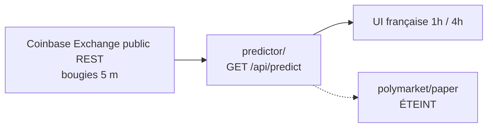

# Fanal

**Prédicteur 1 h / 4 h** BTC (et ETH) sur bougies Coinbase 5 minutes. Ce n’est **pas** un bot Polymarket 5 minutes, ni l’ancien Fanal 5 secondes.

Interface française. Jouet de recherche, pas un conseil financier.

Repo : [github.com/Jayvy2002/fanal](https://github.com/Jayvy2002/fanal)

## Produit

1. **Live** — `/api/predict` (seul cerveau). Horizons `horizon_s=3600` (1 h) et `14400` (4 h). LightGBM sur barres 5 m **complètes**. Trait or = move calibré (pas un croquis 1 bp). Confiance = P(↑) calibrée. Appel HAUSSIER / BAISSIER seulement si `|P−0,5|` ≥ τ (tuné sur VAL pour E TEST, pas pour l’acc headline). Sinon NEUTRE. Pas de faux 99 %.
2. **Paper Polymarket** — **éteint**. Le code intra/lock/CLOB reste dans le repo ; `fire` est forcé false, **aucun ticket**. Aucun ordre live, aucune clé.

`horizon_s=60|300` est encore accepté et **mappé vers 1 h**. Ça ne pilote plus aucun trade.

## Architecture



```
GET /api/predict?symbol=BTC-USD&horizon_s=3600
GET /api/predict?symbol=BTC-USD&horizon_s=14400
```

```json
{
  "symbol": "BTC-USD",
  "horizon_s": 3600,
  "p_up": 0.54,
  "expected_abs_move_bps": 20.1,
  "confidence": 0.54,
  "fire": true,
  "side": "up",
  "label": "HAUSSIER",
  "kind": "lgbm",
  "bar_s": 300,
  "venue": "coinbase"
}
```

`fire` ici = **appel UI** (gate τ). Le paper ignore et n’ouvre rien.

## TEST held-out (150 j, barres 5 m, BTC+ETH)

Walk-forward expanding (4 folds) sur le préfixe, puis TRAIN 80 % / VAL 20 % du non-TEST, **TEST = 15 % final**. Pas de shuffle. Features sur barres complètes seulement : ret 15 m / 1 h / 4 h / 12 h / 24 h, range, vol, volume, heure UTC, jour de semaine, dummy ETH.

Naive = signe du rendement de la période précédente (`ret_12` pour 1 h, `ret_48` pour 4 h).

E@10 bp et E@120 bp = **scénarios de coût** (hypothèse maker intro Coinbase round-trip), **pas** une promesse de trader.

| Tête | n gated | Acc gated | Acc plat | Naive | Couverture | mean \|move\| | Brier | E@10 bp | E@120 bp |
|---|---|---|---|---|---|---|---|---|---|
| **1 h** | 2 453 | 51,9 % | 50,9 % | 48,5 % | 19,1 % | 19,7 bp | 0,250 | **−9,1 bp** | −119,1 bp |
| **4 h** | 3 188 | 51,8 % | **45,7 %** | 46,5 % | 24,8 % | 46,3 bp | 0,252 | **−2,8 bp** | −112,8 bp |

τ 1 h = 0,54 ; τ 4 h = 0,52 (choisi sur VAL pour E@10 bp, n min, **pas** pour l’acc).

**La 4 h à plat ne bat pas le naive.** La 1 h le bat de peu. Brier ≈ 0,25 / logloss ≈ 0,69 : pile-ou-face. On ne shippe pas une UI « forte ».

BTC vs ETH (TEST, acc plat) :

| | 1 h plat | 1 h naive | 4 h plat | 4 h naive |
|---|---|---|---|---|
| BTC | 51,1 % | 48,9 % | 44,2 % | 46,9 % |
| ETH | 50,6 % | 48,0 % | 47,1 % | 46,0 % |

Walk-forward 1 h acc plat : 47,1 / 52,2 / 54,3 / 52,5 (fold 1 sous le naive). 4 h : 44,8 / 52,7 / 47,0 / 55,4 — instable.

Après 10 bp de friction, l’espérance signée TEST est **négative** sur les deux têtes. Ce n’est pas un signal tradable.

## Paper Polymarket (éteint)

Conservé pour l’historique. `tryEnter` no-op. UI : panneau **OFF / éteint**. Aucun take CLOB, aucun lock, aucun intra.

**Aucun ordre CLOB. Aucune clé privée. Aucun wallet USDC. Aucun retrait.**

## Lancer en local

```bash
cd frontend
npm i
npm run dev
```

Vite (`http://localhost:5173`) proxifie `/api/*`.

```bash
# tests contrat 1h/4h + paper éteint
npx tsx netlify/functions/lib/fanal.test.ts

# ré-entraîner (candles publiques, ~150 j 5 m)
python3 train/fetch_coinbase_5m.py 150
python3 train/train_horizon.py 150
```

## Déployer sur Netlify

1. Importer le repo `Jayvy2002/fanal`.
2. Réglages dans `netlify.toml` — pas de secrets.

| Réglage | Valeur |
|---|---|
| Base directory | `frontend` |
| Build command | `npm run build` |
| Publish directory | `dist` |
| Functions | `netlify/functions` |

SPA fallback `/* → /index.html` **après** `/api/*`.

## API

- `GET /api/health`
- `GET /api/predict?symbol=BTC-USD|ETH-USD&horizon_s=3600|14400`
- `GET /api/live?symbol=` — 1 h + 4 h + spark 5 m + paper éteint
- `GET /api/ticker` · `GET /api/book` — Coinbase public
- `GET /api/paper-poly` — snapshot (éteint, sans pas)
- `GET /api/paper-tick` — no-op côté tickets

## Honnêteté

Succès = un prédicteur dont le TEST est lisible, pas un jour vert. Ici le TEST est au niveau d’un pile-ou-face légèrement meilleur que le momentum sur 1 h, et **pire** à plat sur 4 h. Les E@10/120 bp sont des scénarios de coût, pas un carnet.
