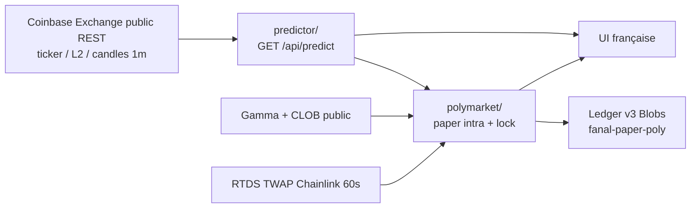

# Fanal

Un seul projet, deux faces :

1. **Prédicteur IA** (le produit) — BTC-USD et ETH-USD, dernières barres 1 minute **complètes** Coinbase Exchange (REST public, aucune clé).
2. **Bot paper Polymarket** — marchés crypto 5 minutes Up/Down. Il ne « pense » pas tout seul : il **importe** le contrat `/api/predict`. Si `fire=false`, l’intra ne fait **rien**.

Ce n’est **pas** l’ancien Fanal 5 secondes, ni un fade 5 minutes. Interface française. Pas un conseil financier.

Repo : [github.com/Jayvy2002/fanal](https://github.com/Jayvy2002/fanal)

## Architecture



Contrat unique (UI et bot) :

```
GET /api/predict?symbol=BTC-USD&horizon_s=60&min_edge_bps=4
```

```json
{
  "ts": 0,
  "symbol": "BTC-USD",
  "horizon_s": 60,
  "p_up": 0.61,
  "expected_move_bps": -8.2,
  "confidence": 0.61,
  "fire": true,
  "side": "down",
  "reasons": []
}
```

- `horizon_s=60` — tête intra (~1 minute).
- `horizon_s=300` — lecture directionnelle du créneau 5 minutes.
- `fire` n’est vrai que si la direction sort de la bande τ **et** que |move| prévu ≥ `min_edge_bps` du **consommateur** (défaut conservateur du modèle).
- `confidence` = probabilité calibrée (bins empiriques VAL), jamais un 99 % inventé.
- Venue live des features : Coinbase Exchange. **Pas de Binance** dans `/api/*`.

Le bot paper appelle `predict()` du même module (pas un second cerveau).

## TEST (split temporel, pas de shuffle)

60 jours de bougies 1 m Coinbase BTC-USD + ETH-USD (2026-06-26 → 2026-08-25). Naive = signe du dernier rendement 1 m.

| Tête | τ | min \|move\| | Acc gated | n | Couverture | Naive | \|move\| moyen | E après 1 bp | Acc plate |
|---|---|---|---|---|---|---|---|---|---|
| **Intra 60 s** | 0,58 | 4 bp | **62,4 %** | 194 | **0,8 %** | 49,1 % | 21,0 bp | **−2,50 bp** | 51,1 % |
| **Slot 5 m** | 0,54 | 4 bp | **55,2 %** | 397 | **1,5 %** | 49,3 % | 20,6 bp | +2,70 bp | 51,7 % |

Intra gated-acc > naive, mais l’espérance **après 1 bp est négative**. Ce n’est pas un edge après friction, et encore moins après frais Polymarket + spread CLOB. L’intra **ne peut marcher** que si le modèle est *avant* les cotes ; on n’a pas d’historique CLOB pour backtester « odds already moved ». Le paper skip quand le livre a déjà bougé.

Le slot 5 m a une petite couverture gated et une E1 positive **sur le spot** — ce n’est pas un PnL Polymarket.

## Paper Polymarket (pas de live)

Deux stratégies, BTC et ETH, marchés `btc-updown-5m-*` / `eth-updown-5m-*` (Gamma public).

**A. Intra-slot odds scalp.** Le prédicteur fire (ex. dump). Le CLOB a encore Down à ~25 ¢. Take virtuel au best ask. Sortie quand le mid a assez bougé pour couvrir les **deux** frais taker + pad, ou scratch (time-stop / fin de slot). Une position par créneau par actif.

**B. Late-window lock.** 60 dernières secondes (pas du last-tick). P(résolution) = projecteur mécanique TWAP officiel vs strike d’ouverture + temps restant + vol récente. Entrée seulement si `P × payout − (1−P) × coût − fee > 0`. Pas d’achat à 90 ¢+ sauf si P ≥ 91 %.

### Règles live (août 2026, page marché)

Lu sur un événement live `btc-updown-5m-*` :

> This market will resolve to "Up" if the time-weighted average price (TWAP) of Bitcoin, generated by Chainlink, of the time range specified in the title is greater than or equal to **the price at the beginning of that range**.

Source : `https://data.chain.link/streams/btc-usd-twap-60s-streams` (ETH analogue). Fenêtre **60 s**, pas 30 s. Strike = TWAP à l’open du range. Si le flux RTDS est stale ou si le strike d’open n’a pas été observé : **skip** — on n’invente pas un mid Coinbase.

### Frais officiels

[docs.polymarket.com/trading/fees](https://docs.polymarket.com/trading/fees) — crypto taker :

```
fee = C × 0.07 × p × (1 − p)   USDC
```

Makers : 0. Pic à 50 ¢. Arrondi 5 décimales.

**Lock à 90 ¢ :** fee/share = 0,07 × 0,90 × 0,10 = **0,0063 USDC**. Break-even `P > 0,9063 ≈ 91 %` de vrais wins.

Ledger virtuel **1 000 USDC**, clip 25 USDC, schéma **v3**, store Blobs `fanal-paper-poly` (fichier local en dev). Pas mélangé avec l’ancien paper Coinbase 5 s.

Horloge : poll UI `/api/live` **1 s** (nécessaire pour l’intra) + function planifiée `paper-tick` **1 min**.

**Aucun ordre CLOB. Aucune clé privée. Aucun wallet USDC. Aucun retrait.**

## Lancer en local

```bash
cd frontend
npm i
npm run dev
```

Vite (`http://localhost:5173`) proxifie `/api/*` vers la même logique que les Netlify Functions.

```bash
# tests (frais, no-fire, exit intra, TWAP stale)
npx tsx netlify/functions/lib/fanal.test.ts

# ré-entraîner (Python 3 + lightgbm/pandas/numpy) — candles 1 m publiques
pip install -r train/requirements.txt
python3 train/train_predictor.py 60
```

## Déployer sur Netlify

1. Importer le repo `Jayvy2002/fanal`.
2. Réglages dans `netlify.toml` — pas de secrets.

| Réglage | Valeur |
|---|---|
| Base directory | `frontend` |
| Build command | `npm run build` |
| Publish directory | `dist` |
| Functions | `netlify/functions` |

SPA fallback `/* → /index.html` **après** `/api/*`.

## API

- `GET /api/health`
- `GET /api/predict?symbol=BTC-USD|ETH-USD&horizon_s=60|300&min_edge_bps=`
- `GET /api/live?symbol=` — prédicteur + spark 1 m + paper Poly (avance l’horloge)
- `GET /api/ticker` · `GET /api/book` — Coinbase public
- `GET /api/paper-poly` — snapshot ledger v3 (sans pas)
- `GET /api/paper-tick` — pas paper (cron 1 min)

## Honnêteté

Succès = architecture propre + paper honnête, pas un jour vert. L’intra 1 m n’a pas d’espérance positive après 1 bp sur TEST. Le CLOB Polymarket est en général déjà informé. Le lock à 90 ¢ est un hurdle de ~91 %, pas un « presque sûr ».
