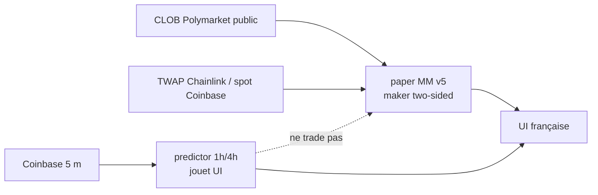

# Fanal

**Paper MM two-sided** Polymarket BTC 5 m Up/Down (style spread + lean, *pas* un oracle de prix) et **prédicteur 1 h / 4 h** LightGBM en jouet UI.

Interface française. Jouet de recherche, pas un conseil financier.

Repo : [github.com/Jayvy2002/fanal](https://github.com/Jayvy2002/fanal)

## Produit

1. **Paper MM two-sided (ON)** — ledger v5, USDC virtuel 1 000, clip ~8 $ / fill (max 8 shares, pas de ticket 100× à 1 ¢). Lit le CLOB public BTC 5 m Up/Down. Poste des **bids virtuels maker** des deux côtés pour un coût pairé cible &lt; 1,00 $ (plafond dur ~1,03 $). Fill seulement sur **trade-through** d’un snapshot *ultérieur* (pas de lookahead). Locks appariés : hold jusqu’à résolution, redeem 1 $ le gagnant / 0 $ le perdant. PnL = `1 × matched − paired_cost − frais taker`. Jambe nue : flatten / scratch / write-off — **pas une loterie $1**.
2. **Prédicteur 1 h / 4 h** — `/api/predict`. LightGBM sur bougies Coinbase 5 m. **Jouet UI.** `fire` n’ouvre aucun ticket. Le MM ne lit pas ce signal.
3. **Paper directionnel LightGBM** — **éteint.** `tryEnter` est un no-op.

**Aucun ordre CLOB live. Aucune clé privée. Aucun wallet. On ne copie pas le wallet ni les ordres de qui que ce soit.**

`horizon_s=60|300` est encore accepté et **mappé vers 1 h**. Ça ne pilote plus aucun trade.

## Ce que ce paper est (et n’est pas)

Ce n’est **pas** un bot « je prédis Up/Down ». C’est un **market-maker paper** :

- **Edge 1 — coût pairé.** 1 share Up + 1 share Down payées &lt; 1 $ (moins frais) lock un spread jusqu’à résolution.
- **Edge 2 — lean fair-value.** P(Up) depuis TWAP officiel vs strike, sinon Coinbase mid vs open de slot, vs p CLOB. Live actuel = **pair 1:1** (`MM_LEAN_RATIO = 1`) : le bucket 1,0–1,5× est skippé (TEST).

Empreinte publique d’un MM 5 m/15 m known (PR&R mars–avril 2026, dashboards plus tard) : ~97 % des marchés two-sided, médiane ~10 s pour apparier, hold to resolution, tickets ~5 $, beaucoup de child fills. **Plus tard**, taker lourd : brut positif, **net de frais négatif** (frais &gt; edge). **On ne réplique pas le spam taker.** Défaut paper = **maker, frais 0**. Take seulement si le coût pairé après `fee = C × 0,07 × p × (1−p)` est encore &lt; 1 $ **et** EV &gt; 0.

Bonereaper en production = **websocket sub-seconde**, ~40 trades/min. Notre paper = poll `/api/live` **1 s** + cron Netlify **1 min**. E attendu = **borne basse / autre régime**, pas une réplication.

## Architecture



```
GET /api/live?symbol=BTC-USD     # poll 1 s : step MM + snapshot + 1 h/4 h
GET /api/predict?symbol=BTC-USD&horizon_s=3600
GET /api/predict?symbol=BTC-USD&horizon_s=14400
GET /api/paper-poly              # snapshot MM (pas d’ordres)
GET /api/paper-tick              # step MM (cron 1 min)
```

`fire` du prédicteur = **appel UI** (gate τ). Le paper MM l’ignore.

## TEST MM (CLOB `prices-history`, BTC 5 m, 18 h)

Simulation maker/taker lock two-sided vs naive one-sided (take le favori, hold to res). Bid/ask reconstruits last/mid ± 1 ¢ — ce n’est pas un carnet L2 historique.

Scoreboard = **E USDC / slot après frais crypto officiels**. Le chiffre négatif est **conservé**.

| | n | E USDC / slot | notes |
|---|---|---|---|
| **Primaire (tous slots, scratch nues inclus)** | 217 | **−1,83** | scoreboard honnête |
| Appariés seulement | 100 | +0,16 | sous-ensemble ; pair moyen 0,980 |
| Naive one-sided | 217 | −0,58 | take le favori, hold to res (même plafond 8 shares) |
| Couverture appariée | 46,1 % | | n_taker = 0 |

Ne pas headline le +0,16. E primaire = **−1,83 $**. Ce n’est **pas** une promesse, et encore moins le net-of-fees d’un taker lourd en production.

Relancer :

```bash
POLY_HOURS=18 python3 train/fetch_poly_history.py   # écrit data/poly/history.json (gitignore)
npx tsx train/backtest_mm.ts                        # écrit _models/mm_test.json
```

## Paper MM (live)

- Univers live : **BTC 5 m** seulement (`MM_ASSETS = ["BTC"]`). ETH / 15 m skippés pour l’instant.
- Cash virtuel 1 000 USDC. Clip 8 $ / max 8 shares. Max 8 fills / slot. Timeout nu ~60 s (ou fin de slot) → flatten maker si possible, sinon scratch / write-off.
- Inventaire apparié tenu jusqu’à résolution. Jambe nue scratchée (pas de loterie $1). Ledger séparé (`fanal-paper-mm`), pas le v4 directionnel.
- UI : **ON**, coût pairé, inventaire ↑/↓, locks vs nues, cash, réalisé après frais. Label **paper / pas de live**.

## Prédicteur 1 h / 4 h (jouet — ne trade pas)

```json
{
  "symbol": "BTC-USD",
  "horizon_s": 3600,
  "p_up": 0.54,
  "fire": true,
  "label": "HAUSSIER"
}
```

`fire` ici n’ouvre **rien**.

### TEST held-out prédicteur (150 j, barres 5 m, BTC+ETH)

Walk-forward expanding (4 folds) sur le préfixe, puis TRAIN 80 % / VAL 20 % du non-TEST, **TEST = 15 % final**. Pas de shuffle.

Naive = signe du rendement de la période précédente (`ret_12` pour 1 h, `ret_48` pour 4 h).

E@10 bp et E@120 bp = **scénarios de coût** (hypothèse maker intro Coinbase round-trip), **pas** une promesse de trader.

| Tête | n gated | Acc gated | Acc plat | Naive | Couverture | mean \|move\| | Brier | E@10 bp | E@120 bp |
|---|---|---|---|---|---|---|---|---|---|
| **1 h** | 2 453 | 51,9 % | 50,9 % | 48,5 % | 19,1 % | 19,7 bp | 0,250 | **−9,1 bp** | −119,1 bp |
| **4 h** | 3 188 | 51,8 % | **45,7 %** | 46,5 % | 24,8 % | 46,3 bp | 0,252 | **−2,8 bp** | −112,8 bp |

τ 1 h = 0,54 ; τ 4 h = 0,52 (choisi sur VAL pour E@10 bp, n min, **pas** pour l’acc).

**La 4 h à plat ne bat pas le naive.** La 1 h le bat de peu. Brier ≈ 0,25 / logloss ≈ 0,69 : pile-ou-face.

## Lancer en local

```bash
cd frontend
npm i
npm run dev
```

Vite (`http://localhost:5173`) proxifie `/api/*`.

```bash
npx tsx netlify/functions/lib/fanal.test.ts

# ré-entraîner le jouet 1 h / 4 h (candles publiques, ~150 j 5 m)
python3 train/fetch_coinbase_5m.py 150
python3 train/train_horizon.py 150
```

## Déployer sur Netlify

1. Importer le repo `Jayvy2002/fanal`.
2. Réglages dans `netlify.toml` — **pas de secrets**.

| Réglage | Valeur |
|---|---|
| Base directory | `frontend` |
| Build command | `npm run build` |
| Publish directory | `dist` |
| Functions | `netlify/functions` |

SPA fallback `/* → /index.html` **après** `/api/*`. Cron `paper-tick` = 1 min, paper MM.

## API

- `GET /api/health` — `paper: mm_v5`, `live_orders: false`
- `GET /api/predict?symbol=BTC-USD|ETH-USD&horizon_s=3600|14400` — jouet, ne trade pas
- `GET /api/live?symbol=` — 1 h + 4 h + spark 5 m + **step paper MM**
- `GET /api/ticker` · `GET /api/book` — Coinbase public
- `GET /api/paper-poly` — snapshot MM
- `GET /api/paper-tick` — step MM (aucun ordre live)

## Honnêteté

Succès = un paper dont le TEST est lisible, pas un jour vert. Ici le TEST MM primaire est **négatif** (−1,83 $ / slot sur 18 h). Le net-of-fees d’un taker lourd plus tard n’est pas une promesse. Le prédicteur 1 h / 4 h reste un pile-ou-face légèrement meilleur que le momentum sur 1 h, et **pire** à plat sur 4 h.
