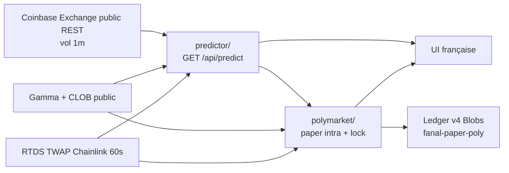

# Fanal

Un seul projet, deux faces :

1. **Prédicteur** — fair value TWAP Chainlink (règles live 5 m Up/Down) vs CLOB Polymarket. Feu **fee-aware**.
2. **Bot paper Polymarket** — n’appelle que `/api/predict`. Si `fire=false`, **aucun** trade.

Ce n’est **pas** l’ancien Fanal 5 secondes, ni un fade 5 minutes. Interface française. Pas un conseil financier.

Repo : [github.com/Jayvy2002/fanal](https://github.com/Jayvy2002/fanal)

## Architecture



Contrat unique (UI et bot) :

```
GET /api/predict?symbol=BTC-USD&horizon_s=60
```

```json
{
  "ts": 0,
  "symbol": "BTC-USD",
  "horizon_s": 60,
  "p_up": 0.72,
  "fire": true,
  "side": "down",
  "edge_usdc": 1.12,
  "p_fair": 0.72,
  "p_clob": 0.22,
  "kind": "fairvalue",
  "reasons": []
}
```

- `fire` n’est vrai que si `E[USDC] > 0` après `fee = C × 0.07 × p × (1−p)` **et** un pad de spread 1–2 ¢, hors bande 40–60 ¢ (sauf mispricing énorme).
- LightGBM 1 m Coinbase reste une **lecture** UI, plus le feu.
- Venue features vol : Coinbase Exchange. **Pas de Binance** dans `/api/*`.

Le bot paper appelle `predict()` du même module. Une position par créneau par actif. Clip 25 USDC.

## TEST (CLOB 36 h, split temporel, après frais Poly)

Historique : Gamma + `prices-history` (last/mid + 1 ¢ ask pad) + candles Coinbase 1 m **complètes** (pas de lookahead sur la bougie en cours). Strike/TWAP = **proxy Coinbase 1 m** — ce n’est **pas** le flux officiel Chainlink (RTDS n’a pas d’historique). Redeem $1/$0, un frais taker (deux si scalp). Naive = take le favori au 1er print, hold to res.

Meilleure config TEST : `default_gap12_ev50` (min gap 12 ¢, min E 0,50 USDC, pad 1,5 ¢). ETH tire E vers le bas → **paper BTC seulement**.

| Univers | n | Couverture | Win rate | **E USDC après frais** | Naive E USDC | Naive wr |
|---|---|---|---|---|---|---|
| **BTC** (config retenue) | 251 | 58,0 % | 26,7 % | **−0,24** | −1,78 | 57,5 % |
| ETH (écarté) | 229 | 52,9 % | 24,5 % | −6,93 | −0,32 | 61,2 % |
| BTC+ETH même config | 480 | 55,4 % | 25,6 % | −3,43 | −1,05 | 59,4 % |
| Naive « take favorite » BTC | 433 | 100 % | 57,5 % | −1,78 | — | — |

**Pas de config TEST avec E[USDC] > 0.** Le chiffre négatif est volontairement conservé.

Pourquoi ça bloque : le CLOB 5 m est déjà informé ; le proxy Coinbase 1 m n’est pas *avant* le livre (et n’est pas le TWAP officiel). Les frais taker `p(1−p)` + 1–2 ¢ de spread mangent le gap restant. Serrer le gate (wings, lock-only, maker rest-bid) empire E. Le naive « acheter le favori » gagne plus souvent (~58 %) mais **perd aussi** après friction. On n’a pas d’historique TWAP Chainlink ni de carnet bid/ask dense.

Ancien LightGBM spot (pour mémoire, **pas** le scoreboard) : intra gated-acc 62,4 % vs naive 49 %, E après 1 bp = −2,50 bp — ce n’était pas du PnL Polymarket.

## Paper Polymarket (pas de live)

**A. Intra.** Fair value TWAP vs CLOB. Take au best ask si `fire=true`. Sortie si le mid couvre **deux** frais + pad, sinon conversion lock dans les 60 dernières secondes (pas de flatten bid). Scratch 40 s si les cotes ne bougent pas **et** que scratch > hold.

**B. Lock.** 60 dernières secondes (pas last-tick, deadzone 8 s). Même cerveau. Porté jusqu’à la résolution **$1 / $0** (un seul frais). Pas d’achat à 90 ¢+ sauf P ≥ 91 %.

### Règles live (août 2026, page marché)

> This market will resolve to "Up" if the time-weighted average price (TWAP) of Bitcoin, generated by Chainlink, of the time range specified in the title is greater than or equal to **the price at the beginning of that range**.

Source : `https://data.chain.link/streams/btc-usd-twap-60s-streams` (ETH analogue). Fenêtre **60 s**, pas 30 s. Strike = TWAP à l’open. Flux stale / strike manquant → **skip**, jamais un mid Coinbase.

### Frais officiels

[docs.polymarket.com/trading/fees](https://docs.polymarket.com/trading/fees) — crypto taker :

```
fee = C × 0.07 × p × (1 − p)   USDC
```

Makers : 0. Pic à 50 ¢. Arrondi 5 décimales.

**Lock à 90 ¢ :** fee/share = 0,07 × 0,90 × 0,10 = **0,0063 USDC**. Break-even `P > 0,9063 ≈ 91 %`.

Ledger virtuel **1 000 USDC**, clip 25 USDC, schéma **v4**, store Blobs `fanal-paper-poly`. ETH skip (TEST).

**Aucun ordre CLOB. Aucune clé privée. Aucun wallet USDC. Aucun retrait.**

## Lancer en local

```bash
cd frontend
npm i
npm run dev
```

Vite (`http://localhost:5173`) proxifie `/api/*`.

```bash
# tests (frais, skip 50¢, no-fire, redeem $1/$0)
npx tsx netlify/functions/lib/fanal.test.ts

# backtest E[USDC] (télécharge ~36 h CLOB + Coinbase)
python3 train/fetch_poly_history.py
npx tsx train/backtest_poly.ts
```

## Déployer sur Netlify

1. Importer le repo `Jayvy2002/fanal`.
2. Réglages dans `netlify.toml` — pas de secrets.

| Réglage | Valeur |
|---|---|
| Base directory | `frontend` |
| Build command | `npm run build` |
| Publish directory | `dist` |
| Functions | `netlify/functions` |

SPA fallback `/* → /index.html` **après** `/api/*`.

## API

- `GET /api/health`
- `GET /api/predict?symbol=BTC-USD|ETH-USD&horizon_s=60|300`
- `GET /api/live?symbol=` — prédicteur + spark 1 m + paper Poly
- `GET /api/ticker` · `GET /api/book` — Coinbase public
- `GET /api/paper-poly` — snapshot ledger v4 (sans pas)
- `GET /api/paper-tick` — pas paper (cron 1 min)

## Honnêteté

Succès = architecture propre + paper honnête, pas un jour vert. TEST après frais taker officiels est **négatif**. Le CLOB est en général déjà informé. Le lock à 90 ¢ est un hurdle de ~91 %, pas un « presque sûr ».
